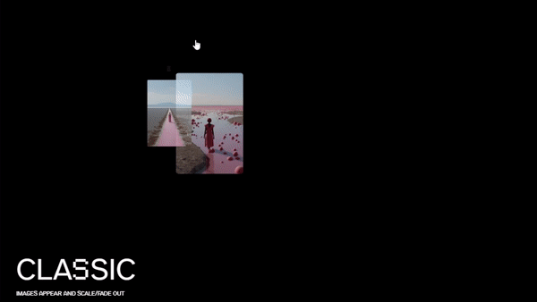

# Motion Trail Animation Component for React

Prepare a background, a list of images and place it under page content.



```tsx
export default function Banners() {

    const [ width, height ] = [ 267, 150 ];

    const images = [
        "/images/banners/1.jpg",
        "/images/banners/2.jpg",
        "/images/banners/3.jpg",
        "/images/banners/4.jpg",
        "/images/banners/5.jpg",
        "/images/banners/6.jpg",
        "/images/banners/7.jpg",
        "/images/banners/8.jpg",
        "/images/banners/9.jpg"
    ];

    // ...
}
```

Inspired by *Manoela Ilic in Playground on October 18, 2023*

[](https://tympanus.net/codrops/2023/10/18/ideas-for-image-motion-trail-animations/)